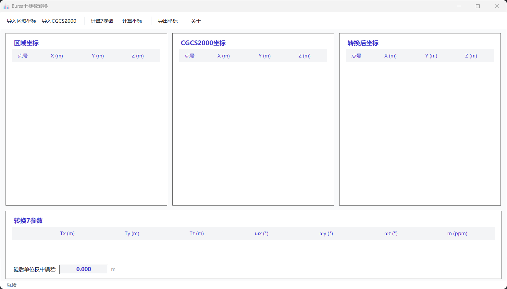

# Bursa七参数转换

基于布尔莎-沃尔夫(Bursa-Wolf)七参数模型的坐标转换工具。


## 功能介绍

利用已知坐标系与目标坐标系中对应的公共点坐标（至少4个），基于布尔莎-沃尔夫模型求解七参数，实现坐标系之间的转换。

### 七参数说明

| 参数 | 含义 | 单位 |
|------|------|------|
| Tx, Ty, Tz | 平移参数 | m |
| ωx, ωy, ωz | 旋转参数 | " (角秒) |
| m | 尺度因子 | ppm |

## 界面预览



软件采用现代化UI设计，三面板布局自适应窗口大小：
- 左侧：区域坐标（源坐标系）
- 中间：CGCS2000坐标（目标坐标系）
- 右侧：转换后坐标
- 底部：七参数及中误差

## 使用方法

1. **导入数据**
   - 点击"导入区域坐标"导入源坐标数据（至少18行）
   - 点击"导入CGCS2000"导入目标坐标数据（至少12行）

2. **计算参数**
   - 点击"计算7参数"求解转换参数
   - 查看参数值、中误差及验后单位权中误差

3. **坐标转换**
   - 点击"计算坐标"转换剩余坐标点
   - 点击"导出坐标"保存结果

### 数据格式

文本文件，每行格式：`点号,X,Y,Z`

```
1,3456789.123,456123.456,45.123
2,3456812.456,456234.567,46.234
...
```

### 快捷键

| 快捷键 | 功能 |
|--------|------|
| Ctrl+I | 导入区域坐标 |
| Ctrl+G | 导入CGCS2000坐标 |
| Ctrl+C | 计算7参数 |
| Ctrl+T | 计算转换坐标 |
| Ctrl+E | 导出坐标 |

## 系统要求

- Windows 7/10/11
- .NET Framework 4.8

## 下载

前往 [Releases](https://github.com/MEKXH/CoordinateConverter/releases) 下载最新版本。

## 许可证

MIT License

## 声明

本软件仅供学习参考，请勿用于商业用途。
